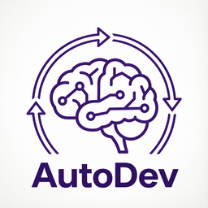

# AutoDev Pipeline

[](https://github.com/ni9aii/AutoDev/actions/workflows/ci.yml)

<p align="center">
  
</p>

**An AI-agent skill for the review → plan → execute → verify → release cycle.**
AutoDev is a self-contained workflow you drop into your own agent harness — not
a CLI app you drive by hand. Once installed, your agent gains a structured
pipeline it runs with its own native tools.

## Install the skill into your harness

The skill is the product. Pick the integration that matches your agent:

### Hermes Agent (reference integration)

```bash
# Copy the skill into your Hermes skills dir
cp -r /path/to/AutoDev ~/.hermes/skills/autodev
```

Then invoke it from a session with `/skill autodev`. The skill orchestrates the
whole pipeline using Hermes native tools (`delegate_task`, `read_file`,
`patch`, `terminal`).

### Claude Code

Use the dedicated Claude Code skill surface:

```bash
cp skills/claude-code/SKILL.md /path/to/your-claude-skills/autodev/SKILL.md
```

### Any other harness

Point your harness at `SKILL.md` in this repo (and keep the `references/`
folder alongside it for the deep-dive guides). AutoDev needs only your agent's
native capabilities — file read/write, shell, and (optionally) subagents.
**No external binaries are required** to run the pipeline end to end.

> **That's it.** There is nothing to "run" from a terminal to use AutoDev — you
> load the skill and let your agent drive it. The Rust binaries below are
> optional accelerators, not a prerequisite.

## How it works

| Layer | Role | Implementation |
|-------|------|----------------|
| **Skill** (`SKILL.md`) | Orchestration & decision-making for the whole pipeline | Agent-native |
| `delegate_task` | Parallel reviewers, complex fixes | Agent-native (Hermes) |
| `read_file` + `patch` | Simple fixes (≤2 files, ≤20 lines) | Agent-native |
| `review-aggregator` | Finding aggregation, dedupe, plan generation | Rust binary (optional) |
| `ci-check` | CI status + local test run | Rust binary (optional) |
| `run-pipeline` | Full phase orchestration (Hermes or legacy mode) | Rust binary (optional) |

In the default **Hermes mode** the entire pipeline executes with your agent's
own tools. The Rust binaries are *accelerators* for the heavier mechanical
steps (deduplicating findings across reviewers, hitting the GitHub API for CI
status) — you can use the skill without them, or add them when you want the
speedup.

### Two execution modes

| Mode | Executors | Requires |
|------|-----------|----------|
| **Hermes** (default) | `delegate_task` / `read_file`+`patch` | Your agent only |
| Legacy | shells out to the `claude -p` CLI | Claude Code CLI, authenticated |

Hermes mode is the integration target for harness users — it never invokes an
external binary, so it works regardless of any other tool's auth state. The
legacy mode is a fallback for agents that wrap Claude Code; it runs a pre-flight
auth check and fails fast with a clear message if `claude` is missing or its
OAuth session has expired (see issue #1).

## Rust binaries (optional accelerators)

Only relevant if you want the binary speedups. Build and install:

```bash
cargo build --release
cargo install --path .        # puts run-pipeline, review-aggregator, ci-check on PATH
```

`run-pipeline` also supports a `--json` flag that emits a machine-readable
summary (status, version, phase, mode, timestamp, output dir) on **stdout** with
all human log output routed to **stderr** — useful when your harness wraps the
binary and parses its result programmatically.

## dev-notes layout

AutoDev keeps its intermediate artifacts in a dev-notes tree (default
`~/obsidian-vault/dev-notes`, override via `--dev-notes-root` or the
`DEV_NOTES_ROOT` env var). This is where the skill writes reviews, plans, and
CI reports per project:

```
$DEV_NOTES_ROOT/
└── <project>/
    ├── reviews/
    │   └── YYYYMMDD_HHMMSS/
    │       ├── code-review.md
    │       ├── security-review.md
    │       ├── architecture-review.md
    │       └── devops-review.md
    ├── plans/
    │   └── YYYYMMDD_HHMMSS-plan.md
    └── ci-reports/
        └── YYYYMMDD_HHMMSS-ci-status.md
```

## Configuration

| Variable | Description |
|----------|-------------|
| `GITHUB_TOKEN` / `GITHUB_PAT` | GitHub API auth (CI checks, releases) |
| `AUTO_DEV_VERSION` | Fallback version for the release phase |
| `DEV_NOTES_ROOT` | Root for dev-notes paths (default: `~/obsidian-vault/dev-notes`) |

## References

The `references/` folder holds deeper integration notes (not required to use
the skill, but useful when adapting it):

| File | Purpose |
|------|---------|
| `references/git-sync-checklist.md` | Pre/post-work git sync steps |
| `references/hermes-delegate-task-integration.md` | `delegate_task` subagent integration guide |
| `references/iteration-2-patterns.md` | Partial-fix traps, regressions, edge cases |

## Project structure

```
.
├── src/
│   ├── lib.rs                  # Shared modules (log, git, markdown, test_runner)
│   └── bin/
│       ├── run_pipeline.rs     # Optional pipeline entry point
│       ├── ci_check.rs         # Optional CI status checker
│       └── review_aggregator.rs # Optional aggregation + plan generation
├── skills/
│   └── claude-code/SKILL.md    # Claude Code skill surface
├── references/                 # Integration & pattern guides
├── .github/workflows/ci.yml    # CI (Arch Linux)
├── Cargo.toml / Cargo.lock
├── README.md
├── SKILL.md                    # The skill — primary integration artifact
└── CHANGELOG.md
```

## References

Deeper integration and pattern notes (not required to use the skill, but
useful when adapting it):

| File | Purpose |
|------|---------|
| `references/skill-walkthrough.md` | Phase-by-phase view of what the skill does |
| `references/hermes-delegate-task-integration.md` | `delegate_task` subagent integration (current code) |
| `references/dev-notes-schema.md` | Exact dev-notes layout, artifact paths, finding format |
| `references/json-output.md` | `run-pipeline --json` output contract |
| `references/iteration-2-patterns.md` | Report parser patterns, Do Now/Defer, regression checklist |
| `references/troubleshooting.md` | FAQ: Claude auth, empty reviews, dev-notes not found |
| `references/git-sync-checklist.md` | Pre/post-work git sync steps |

## License

MIT — see [LICENSE](LICENSE).
