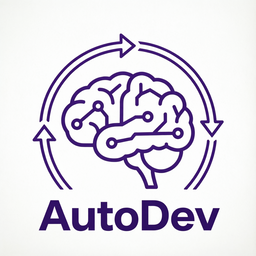

# AutoDev Pipeline

[](https://github.com/ni9aii/AutoDev/actions/workflows/ci.yml)

<p align="center">
  
</p>

**An AI-agent skill for the review → plan → execute → verify → release cycle.**
AutoDev is a self-contained workflow you drop into your own agent harness — not
a CLI app you drive by hand. Once installed, your agent gains a structured
pipeline it runs with its own native tools.

### Why AutoDev

Most "vibe coding" stops at a first working draft. AutoDev takes an existing
concept and **cycles it to done** — review → code → test (locally and on CI) →
repeat, until *you* decide the project is good enough to release. Each loop
tightens the code instead of shipping the lucky first pass.

- **Loop until release-ready.** Review → execute → verify re-runs every
  iteration, so defects found late get fixed, not deferred.
- **Local + CI, not just local.** Fixes are verified by your test suite *and*
  GitHub Actions.
- **Reproducible, file-based trail.** Every review, plan, and CI report lands
  in `dev-notes/` as plain markdown — traceable, diffable, git-friendly.
- **Multi-harness by design.** The skill is just `SKILL.md` + `references/`;
  any agent harness can load it. Bundled Rust binaries are *optional
  accelerators*, not a requirement.
- **Developed on itself.** Every AutoDev release was produced and hardened by
  AutoDev's own review cycles — see [docs/development-by-cycles.md](docs/development-by-cycles.md).

## Install the skill into your harness

One command — no checkout needed:

```bash
curl -fsSL https://raw.githubusercontent.com/ni9aii/AutoDev/main/install.sh | bash -s -- --remote
```

The installer auto-detects your harness (Hermes, Claude Code), downloads a
release tarball, and installs a self-contained copy of the skill with its
references. Re-run the same command (or `install.sh --update` from a checkout)
to upgrade; `--uninstall` removes it; a version stamp in the installed skill
dir tells you which release you have.

From a checkout instead:

```bash
git clone https://github.com/ni9aii/AutoDev && cd AutoDev
./install.sh                 # auto-detects harness
./install.sh --harness hermes | claude-code   # force one
./install.sh --list          # supported harnesses + paths
./install.sh --check         # verify install without changes
```

After install, load the skill in your agent and run a phase, e.g.
`/autodev /path/to/project review`.

| Harness     | Install path                                    | Invoke with      |
|-------------|--------------------------------------------------|------------------|
| Hermes      | `~/.hermes/skills/autonomous-ai-agents/autodev`  | `/skill autodev` |
| Claude Code | `~/.claude/skills/autodev`                       | `/autodev`       |

## Quickstart

```bash
run-pipeline /path/to/project review --project myproject    # 4 reviewers → reports
run-pipeline /path/to/project plan --project myproject      # aggregate → fix plan
run-pipeline /path/to/project full --project myproject      # all phases incl. verify
```

Each run leaves a timestamped trail under `$DEV_NOTES_ROOT/<project>/`
(reviews, plans as `.md` + machine-readable `.json`, CI reports). Your agent
executes the plan; the pipeline verifies locally and on CI.

## Documentation

Full documentation lives in [`docs/`](docs/):

| Doc | Purpose |
|-----|---------|
| [docs/how-it-works.md](docs/how-it-works.md) | Architecture: skill layer vs Rust accelerators, execution model |
| [docs/installation.md](docs/installation.md) | Installer details: flags, manual install, update/uninstall |
| [docs/dev-notes-layout.md](docs/dev-notes-layout.md) | Artifact tree, file formats, plan sidecar contract |
| [docs/configuration.md](docs/configuration.md) | Env vars (`GITHUB_TOKEN`, `DEV_NOTES_ROOT`, …) |
| [docs/project-structure.md](docs/project-structure.md) | Repository layout (generated, drift-checked) |
| [docs/development-by-cycles.md](docs/development-by-cycles.md) | How AutoDev develops itself, cycle by cycle |
| [references/](references/) | Deep-dive notes: JSON output contract, troubleshooting, patterns |

## Examples

A fully worked sample: four review reports → a generated fix plan
([`examples/sample-project/plans/`](examples/sample-project/plans/)) and a
machine-readable [`--json` summary](examples/json-output.json).

## Contributing

See [CONTRIBUTING.md](CONTRIBUTING.md). Adding support for a new agent harness
is a single overlay file plus installer wiring — see
[docs/new-harness.md](docs/new-harness.md).

## License

MIT — see [LICENSE](LICENSE).
